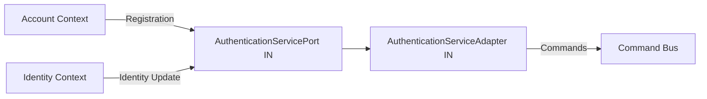
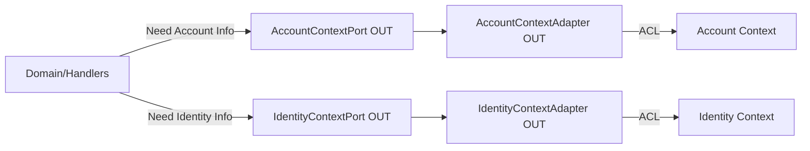

## CAHIER DES CHARGES - DOCUMENTATION DES ADAPTERS

### 1. OBJECTIFS

- Établir une convention claire pour documenter les adapters IN/OUT
- Éliminer toute ambiguïté sur la direction des flux
- Faciliter l'onboarding des nouveaux développeurs
- Maintenir une cohérence dans tout le projet

### 2. CONVENTIONS DE DOCUMENTATION

#### 2.1 STRUCTURE OBLIGATOIRE DES COMMENTAIRES

Chaque interface Port et classe Adapter DOIT contenir un bloc PHPDoc avec les sections suivantes :

```php
/**
 * [Description courte de la responsabilité]
 * 
 * @context-boundary
 * Direction: [IN|OUT] ([ContexteSource] → [ContexteDestination])
 * Type: [Port|Adapter]
 * Protocol: [Sync|Async] via [Mécanisme]
 * 
 * @see [Référence au port/adapter correspondant]
 */
```

#### 2.2 TEMPLATE PORT IN

```php
<?php

declare(strict_types=1);

namespace Authentication\Infrastructure\Port\In;

/**
 * Port exposé par le contexte Authentication pour les appels entrants.
 * 
 * @context-boundary
 * Direction: IN (External Contexts → Authentication)
 * Type: Port (Interface)
 * Protocol: Sync via Method Call
 * 
 * Ce port définit les opérations que les autres contextes peuvent
 * appeler sur le contexte Authentication. Il fait partie de l'API
 * publique du contexte.
 * 
 * @see \Authentication\Infrastructure\Adapter\In\AuthenticationServiceAdapter
 */
interface AuthenticationServicePort
{
    /**
     * Crée des credentials de connexion pour un utilisateur.
     * 
     * Called by: Account Context (during registration)
     * 
     * @param string $userId L'identifiant de l'utilisateur
     * @param string $identifier L'identifiant de connexion (email/phone)
     * @throws AuthenticationException Si la création échoue
     */
    public function createLoginCredentials(string $userId, string $identifier): void;

    /**
     * Révoque tous les credentials d'un utilisateur.
     * 
     * Called by: Account Context (during account deletion)
     * 
     * @param string $userId L'identifiant de l'utilisateur
     */
    public function revokeAllCredentials(string $userId): void;
}
```

#### 2.3 TEMPLATE ADAPTER IN

```php
<?php

declare(strict_types=1);

namespace Authentication\Infrastructure\Adapter\In;

use Authentication\Infrastructure\Port\In\AuthenticationServicePort;
use Authentication\Application\Command\CreateCredentialsCommand;
use Kernel\Application\Bus\CommandBusInterface;

/**
 * Adapter qui implémente le port d'entrée du contexte Authentication.
 * 
 * @context-boundary
 * Direction: IN (External Contexts → Authentication)
 * Type: Adapter (Implementation)
 * Protocol: Sync via Method Call
 * 
 * Cet adapter traduit les appels externes en commandes internes
 * du contexte Authentication. Il agit comme un Anti-Corruption Layer
 * protégeant le domaine des changements externes.
 * 
 * @implements AuthenticationServicePort
 */
final class AuthenticationServiceAdapter implements AuthenticationServicePort
{
    /**
     * @param CommandBusInterface $commandBus Bus de commandes interne
     */
    public function __construct(
        private readonly CommandBusInterface $commandBus
    ) {}

    /**
     * {@inheritDoc}
     * 
     * Traduction:
     * - Appel externe → CreateCredentialsCommand interne
     * - String $userId → UserId Value Object
     * - String $identifier → Identifier Value Object
     */
    public function createLoginCredentials(string $userId, string $identifier): void
    {
        // Traduction des types primitifs en Value Objects du domaine
        $command = new CreateCredentialsCommand(
            UserId::fromString($userId),
            IdentifierFactory::create($identifier)
        );
        
        $this->commandBus->dispatch($command);
    }
}
```

#### 2.4 TEMPLATE PORT OUT

```php
<?php

declare(strict_types=1);

namespace Authentication\Infrastructure\Port\Out;

/**
 * Port requis par le contexte Authentication pour communiquer avec Account.
 * 
 * @context-boundary
 * Direction: OUT (Authentication → Account)
 * Type: Port (Interface)
 * Protocol: Sync via ACL
 * 
 * Ce port définit les opérations dont le contexte Authentication
 * a besoin du contexte Account. C'est une dépendance externe qui
 * doit être satisfaite pour que Authentication fonctionne.
 * 
 * @see \Authentication\Infrastructure\Adapter\Out\AccountContextAdapter
 */
interface AccountContextPort
{
    /**
     * Vérifie si un compte utilisateur est actif.
     * 
     * Calls to: Account Context
     * Used in: Login process validation
     * 
     * @param string $userId Identifiant de l'utilisateur
     * @return bool True si le compte est actif
     * @throws AccountContextException Si la communication échoue
     */
    public function isAccountActive(string $userId): bool;

    /**
     * Récupère l'email principal d'un compte.
     * 
     * Calls to: Account Context  
     * Used in: Magic link generation
     * 
     * @param string $userId Identifiant de l'utilisateur
     * @return string|null Email ou null si non trouvé
     */
    public function getAccountEmail(string $userId): ?string;
}
```

#### 2.5 TEMPLATE ADAPTER OUT

```php
<?php

declare(strict_types=1);

namespace Authentication\Infrastructure\Adapter\Out;

use Authentication\Infrastructure\Port\Out\AccountContextPort;
use SharedKernel\Domain\Service\AccountContextInterface;

/**
 * Adapter pour communiquer avec le contexte Account.
 * 
 * @context-boundary
 * Direction: OUT (Authentication → Account)
 * Type: Adapter (Implementation)
 * Protocol: Sync via ACL Interface
 * 
 * Cet adapter implémente la communication sortante vers le contexte
 * Account. Il traduit les appels du domaine Authentication vers
 * l'interface ACL partagée avec Account.
 * 
 * @implements AccountContextPort
 */
final class AccountContextAdapter implements AccountContextPort
{
    /**
     * @param AccountContextInterface $accountContext Interface ACL du contexte Account
     */
    public function __construct(
        private readonly AccountContextInterface $accountContext
    ) {}

    /**
     * {@inheritDoc}
     * 
     * Traduction:
     * - String → UserId VO dans l'appel ACL
     * - AccountDTO response → boolean
     * - Gestion des exceptions ACL → exceptions locales
     */
    public function isAccountActive(string $userId): bool
    {
        try {
            $accountInfo = $this->accountContext->getAccountInfo(
                UserId::fromString($userId)
            );
            
            return $accountInfo->status === 'active';
        } catch (AccountNotFoundException $e) {
            // Traduction d'exception externe en comportement local
            return false;
        }
    }
}
```

### 3. DIAGRAMME DE FLUX OBLIGATOIRE

Chaque module doit maintenir un diagramme de ses flux IN/OUT :

# Authentication Context - Flux IN/OUT

## Flux IN (Appels entrants)


## Flux OUT (Appels sortants)


### 4. CONVENTIONS DE NOMMAGE

#### 4.1 Interfaces Port

- **IN**: `[Service]ServicePort` (ce que le contexte expose)
- **OUT**: `[ContexteCible]ContextPort` (ce que le contexte consomme)

#### 4.2 Classes Adapter

- **IN**: `[Service]ServiceAdapter`
- **OUT**: `[ContexteCible]ContextAdapter`

### 5. RÈGLES DE DOCUMENTATION DES MÉTHODES

Chaque méthode DOIT documenter :

**Pour les Ports IN :**
- `Called by: [Contexte(s) appelant(s)]`
- `When: [Scénario d'utilisation]`

**Pour les Ports OUT :**
- `Calls to: [Contexte cible]`
- `Used in: [Processus métier]`

### 6. EXEMPLE DE STRUCTURE COMPLÈTE

```
Authentication/
└── Infrastructure/
    ├── Port/
    │   ├── In/
    │   │   ├── AuthenticationServicePort.php
    │   │   └── README.md (liste des opérations exposées)
    │   └── Out/
    │       ├── AccountContextPort.php
    │       ├── IdentityContextPort.php
    │       └── README.md (liste des dépendances)
    └── Adapter/
        ├── In/
        │   └── AuthenticationServiceAdapter.php
        └── Out/
            ├── AccountContextAdapter.php
            └── IdentityContextAdapter.php
```

### 7. CHECKLIST DE VALIDATION

- [ ] Chaque Port a son header `@context-boundary`
- [ ] La direction est clairement indiquée (IN/OUT)
- [ ] Le flux est documenté (Source → Destination)
- [ ] Le protocole est spécifié (Sync/Async)
- [ ] Les méthodes ont leurs annotations Called by/Calls to
- [ ] Un diagramme de flux existe pour le contexte
- [ ] Les exceptions sont documentées
- [ ] Les traductions de types sont expliquées

### 8. OUTILS DE VALIDATION

**Script de vérification PHPStan :**
```php
// phpstan-rules.neon
parameters:
    rules:
        - Ensure @context-boundary tag exists for Port/Adapter classes
        - Ensure Direction is specified (IN|OUT)
        - Ensure Called by/Calls to in method docs
```

**Pre-commit hook :**
```bash
#!/bin/bash
# Vérifie que tous les fichiers Port/Adapter ont la doc requise
grep -L "@context-boundary" src/*/Infrastructure/Port/**/*.php
grep -L "@context-boundary" src/*/Infrastructure/Adapter/**/*.php
```

Cette documentation garantit que chaque développeur comprendra immédiatement le rôle et la direction de chaque adapter dans l'architecture.
