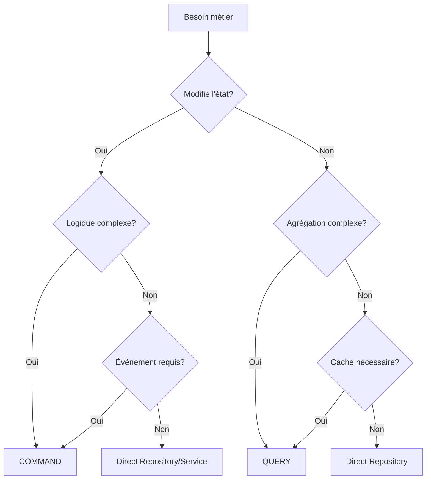

## CAHIER DES CHARGES - COMMAND VS QUERY & SIMPLIFICATION

### 1. CRITÈRES DE DÉCISION COMMAND VS QUERY

#### 1.1 UTILISER UNE COMMAND QUAND :

✅ **Modification d'état**
- Création, modification, suppression d'entités
- Changement de statut/workflow
- Déclenchement d'effets de bord

✅ **Logique métier complexe**
- Validation métier multi-étapes
- Orchestration de plusieurs agrégats
- Application de règles métier

✅ **Événements domaine**
- L'action doit émettre des événements
- Besoin de traçabilité/audit
- Déclenchement de processus asynchrones

✅ **Transactionnalité requise**
- Opération tout ou rien
- Besoin de compensation/rollback
- Cohérence forte nécessaire

#### 1.2 UTILISER UNE QUERY QUAND :

✅ **Lecture pure**
- Aucune modification d'état
- Projections de données
- Rapports et statistiques

✅ **Agrégation complexe**
- JOIN sur plusieurs tables
- Calculs et transformations
- Filtrage et pagination avancés

✅ **Performance critique**
- Besoin de cache
- Optimisations de lecture
- Projections dénormalisées

### 2. CONVENTION DE NOMMAGE SANS SUFFIXE

```php
// ❌ ANCIEN
CreateAccountCommand
GetAccountByIdQuery

// ✅ NOUVEAU
namespace Account\Application\Command;
class CreateAccount { }

namespace Account\Application\Query;
class GetAccountById { }
```

### 3. ARBRE DE DÉCISION - ÉVITER LA SUR-ABSTRACTION



### 4. RÈGLES D'IMPLÉMENTATION

#### 4.1 APPEL DIRECT AU REPOSITORY

**✅ AUTORISÉ QUAND :**
```php
// Dans un Domain Service - logique simple
class AccountService
{
    public function __construct(
        private AccountRepositoryInterface $repository
    ) {}
    
    public function accountExists(UserId $userId): bool
    {
        // Simple vérification - pas besoin de Command/Query
        return $this->repository->exists($userId);
    }
}

// Dans un Application Service - opération CRUD basique
class AccountApplicationService
{
    public function findAccount(string $userId): ?AccountDTO
    {
        // Simple fetch by ID - pas besoin de Query
        $account = $this->repository->ofId(UserId::fromString($userId));
        return $account ? AccountDTO::fromDomain($account) : null;
    }
}
```

**❌ INTERDIT QUAND :**
- Modification avec règles métier
- Besoin d'émission d'événements
- Orchestration multi-agrégats
- Depuis un Controller/Port IN

#### 4.2 COMMAND OBLIGATOIRE

```php
// Règles métier complexes
namespace Account\Application\Command;

final class SuspendAccount
{
    public function __construct(
        public readonly UserId $userId,
        public readonly string $reason,
        public readonly ?\DateTimeImmutable $until = null
    ) {}
}

final class SuspendAccountHandler
{
    public function __invoke(SuspendAccount $command): void
    {
        $account = $this->repository->ofId($command->userId);
        
        // Logique métier complexe
        if (!$account->canBeSuspended()) {
            throw new AccountCannotBeSuspendedException();
        }
        
        $account->suspend($command->reason, $command->until);
        
        // Événement domaine
        $this->eventBus->dispatch(new AccountSuspended(
            $command->userId,
            $command->reason
        ));
        
        $this->repository->save($account);
    }
}
```

#### 4.3 QUERY OBLIGATOIRE

```php
// Agrégation complexe
namespace Account\Application\Query;

final class GetAccountsWithActivity
{
    public function __construct(
        public readonly \DateTimeInterface $since,
        public readonly ?string $status = null,
        public readonly int $page = 1,
        public readonly int $perPage = 20
    ) {}
}

final class GetAccountsWithActivityHandler
{
    public function __invoke(GetAccountsWithActivity $query): PaginatedResult
    {
        // Requête complexe avec JOINs
        $qb = $this->createQueryBuilder('a')
            ->leftJoin('a.activities', 'act')
            ->where('act.createdAt > :since')
            ->setParameter('since', $query->since);
            
        if ($query->status) {
            $qb->andWhere('a.status = :status')
               ->setParameter('status', $query->status);
        }
        
        // Cache et pagination
        return $this->paginator->paginate(
            $qb,
            $query->page,
            $query->perPage
        );
    }
}
```

### 5. PATTERNS D'UTILISATION

#### 5.1 CONTROLLER → COMMAND/QUERY

```php
class AccountController
{
    // ✅ TOUJOURS via Command/Query depuis les controllers
    public function suspend(Request $request): Response
    {
        $this->commandBus->dispatch(new SuspendAccount(
            userId: UserId::fromString($request->get('userId')),
            reason: $request->get('reason')
        ));
        
        return new Response(null, 204);
    }
    
    public function list(Request $request): Response
    {
        $result = $this->queryBus->ask(new GetAccountsWithActivity(
            since: new \DateTime('-30 days'),
            status: $request->get('status')
        ));
        
        return $this->json($result);
    }
}
```

#### 5.2 SERVICE → REPOSITORY DIRECT

```php
class RegistrationService
{
    // ✅ OK - Service interne, logique simple
    private function checkEmailAvailable(string $email): bool
    {
        return !$this->accountRepository->existsByEmail(
            EmailAddress::fromString($email)
        );
    }
    
    // ❌ NON - Logique métier complexe
    private function createAccount(array $data): void
    {
        // Devrait être une Command
        $this->commandBus->dispatch(new CreateAccount(...));
    }
}
```

### 6. CHECKLIST DE VALIDATION

**POUR UNE COMMAND :**
- [ ] Modifie l'état du système
- [ ] Contient de la logique métier
- [ ] Émet des événements domaine
- [ ] Nécessite une transaction
- [ ] Peut échouer avec des règles métier

**POUR UNE QUERY :**
- [ ] Lecture seule
- [ ] Agrégation ou transformation complexe
- [ ] Besoin de cache ou optimisation
- [ ] Projection spécifique pour l'UI
- [ ] Pagination ou filtrage avancé

**POUR UN APPEL DIRECT :**
- [ ] Opération CRUD simple
- [ ] Pas d'événements à émettre
- [ ] Utilisé uniquement dans un Service
- [ ] Pas de règles métier complexes
- [ ] Performance non critique

### 7. EXEMPLES CONCRETS

```php
// ✅ COMMAND - État + Règles + Événements
namespace Authentication\Application\Command;
class CreateMagicLink
{
    public function __construct(
        public readonly UserId $userId,
        public readonly EmailIdentity $email
    ) {}
}

// ✅ QUERY - Agrégation complexe
namespace Authentication\Application\Query;
class GetLoginStatistics
{
    public function __construct(
        public readonly UserId $userId,
        public readonly \DateTimeInterface $since
    ) {}
}

// ✅ DIRECT - Simple check dans un service
class CredentialService
{
    public function isCredentialExpired(CredentialId $id): bool
    {
        $credential = $this->repository->find($id);
        return $credential && $credential->isExpired();
    }
}

// ❌ MAUVAIS - Command qui devrait être Query
namespace Account\Application\Command;
class GetAccountStatus // Devrait être une Query!

// ❌ MAUVAIS - Query qui modifie
namespace Account\Application\Query;
class UpdateLastLogin // Devrait être une Command!
```

### 8. MIGRATION PROGRESSIVE

**Phase 1 :** Supprimer les suffixes Command/Query
**Phase 2 :** Identifier les Commands déguisées en Services
**Phase 3 :** Simplifier les cas d'over-engineering
**Phase 4 :** Documenter les exceptions aux règles

Cette approche élimine la confusion et réduit la sur-abstraction tout en maintenant une architecture CQRS claire.
