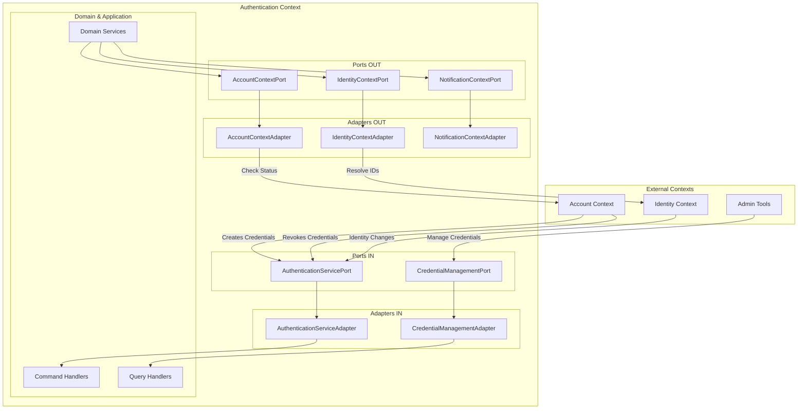

# Authentication Context - Architecture des Ports & Adapters

## Vue d'ensemble des flux



## Flux détaillé : Création de Magic Link

```
sequenceDiagram
    participant AC as Account Context
    participant ASP as AuthenticationServicePort IN
    participant ASA as AuthenticationServiceAdapter IN
    participant CH as CreateMagicLinkHandler
    participant ACP as AccountContextPort OUT
    participant ACA as AccountContextAdapter OUT
    participant ACC as Account Context (ACL)
    
    AC->>ASP: createMagicLinkCredentials(userId, email)
    ASP->>ASA: Implement interface
    ASA->>ASA: Convert strings to VOs
    ASA->>CH: dispatch(CreateMagicLinkCommand)
    CH->>ACP: isAccountActive(userId)
    ACP->>ACA: Implement interface
    ACA->>ACC: getAccountStatus(UserId)
    ACC-->>ACA: AccountStatusDTO
    ACA-->>ACP: boolean
    ACP-->>CH: true
    CH->>CH: Create MagicLink
    CH->>CH: Send email
    CH-->>ASA: Success
    ASA-->>ASP: void
    ASP-->>AC: Complete
```
